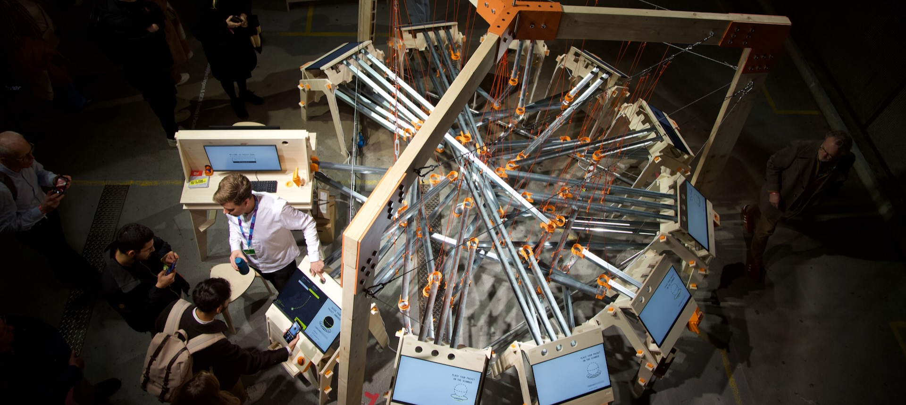

   

 

Packet Run is an interactive art installation that visualises how data travels
across the internet in discrete packets. This process is known as **Internet
Protocol routing**.

Packet Run aims to clarify the hidden process of packet routing, thereby showing
everyday users what this process looks like, what risks are involved in the
process and what the future of the internet could look like.

Packet Run has been exhibited at the **2023 Dutch Design Week**,
October 21-29 2023. Afterwards, Packet Run is available for exhibition at
festivals, conferences and cultural institutions. 

For questions and inquiries, please get in touch with [Lei
Nelissen](https://leinelissen.com).

## Repository

This repository aims to contain all software, hardware, designs and other pieces
that are used to construct Packet Run and to make it tick. 

This repository is split out into a couple different directories that track
various assets, bits and pieces:
* `./client`: Contains all software that is run directly on the terminal units
* `./designs`: Contains various designs, ranging from logos, designed copy to
  STL files for the CNCed and 3D-printed parts of the installation. 
* `./documentation`: Contains documentation for how the installation is built,
  compiled and operated. Find here, for instance:
  * [The architectural diagram for Packet Run](./documentation/architecture.md)
  * [The project planning until the 2023 DDW](./documentation/planning.md)
* `./server`: Contains all software that is run on the server

## Contributors

Packet Run was designed and built by **Bureau Moeilijke Dingen**, an Eindhoven-based
design studio that stimulates self-expression and autonomy through technology.

These people from Bureau Moeilijke Dingen contributed to Packet Run:
* Tijs Duel (3D Design, Mechanical Engineering)
* Jort Band (Technology, Management)
* Eva van der Born (UI/UX, Mechanical Engineering, Construction)
* Joep Elderman (Mechanical Engineering, Construction)
* Bart van Dijk (3D Design, Mechincal Engineering)
* Nils Hollestelle (Graphical Design, Construction)
* Lei Nelissen (Design, Project Management, Technology)

 

Packet Run was based on [PathVis](https://github.com/SIDN/pathvis), an open
source tool that visualises traceroutes. PathVis was built by **SIDN Labs**, an
experimental group at the .NL domain registry focusing on experimental
technology at the core of the internet.

These people from SIDN Labs contributed to PathVis and Packet Run:
* Elmer Lastdrager
* Ralph Koning
* Caspar Schutijser
* Jelte Jansen

 

Building Packet Run was made possible by a grant from **SIDN Fonds**, a public
fund that supports and strengthens the internet and its users. 

## Mentions & Media
After being exhibited at the 2023 Dutch Design Week, some media has picked up on
Packet Run. This is an (incomplete) collection of such mentions. Do note that
some (most) links are in Dutch.

- [Vint Cerf mentions Packet Run](https://elists.isoc.org/pipermail/internet-history/2023-November/009107.html)
- [Nemo Kennislink: Het internet als knikkerbaan](https://www.nemokennislink.nl/publicaties/het-internet-als-knikkerbaan/)
- [Studio 040: Opbouw Dutch Design Week in volle gang (video)](https://studio040.nl/nieuws/artikel/opbouw-dutch-design-week-in-volle-gang-ik-denk-dat-wij-voor-iedereen-hier-iets-te-bieden-hebben)
- [Telegraaf: Van dickpic booth tot volgelhuis uit riool...](https://www.telegraaf.nl/entertainment/804337822/van-dickpic-booth-tot-vogelhuis-uit-riool-waar-kijk-ik-naar-klinkt-massaal-tijdens-dutch-design-week)
- [SIDN: Packet Run is an interactive marble run...](https://www.sidn.nl/en/news-and-blogs/packet-run-is-an-interactive-marble-run-that-shows-people-how-the-internet-works)

## Video
Some recording were made at the Dtuch Design Week, so you can get an impression
of what Packet Run is like.

 