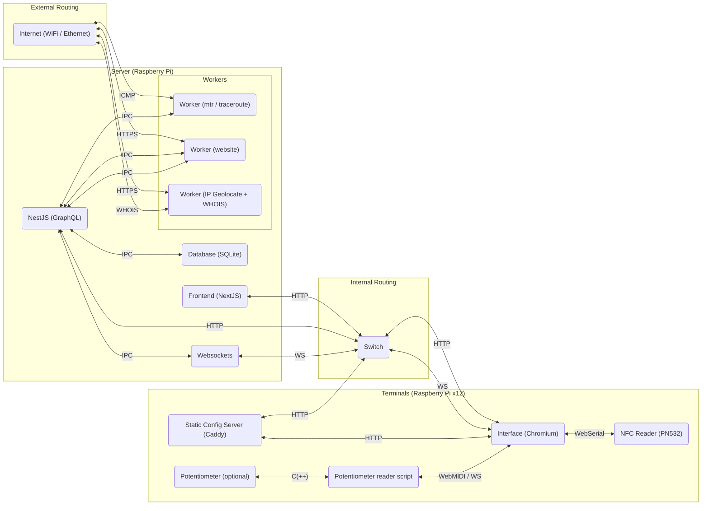

# DDW2023 Software Architecture

## System diagram



## Table structure

### Relational

```mermaid

```

### Flat
```ts
/**
 * A single run tracks all data that is required for handling a succesful user
 * journey across the installation.
 */
interface Run {
    /** 
     * Uniquely identifies a full run. 
     * Format: nano-id, 12 characters (e.g. LtDWYYqPXujf) 
     */
    id: string;
    /** 
     * Format: 4- or 7-byte integer, hexadecimally encoded (e.g. 
     * `04 9C 64 D2 45 2B 80`).
     * NOTE: balls / NFC ID's MAY BE re-used, so there are no guarantees that 
     * an NFC ID uniquely identifies a particular request.
     */
    nfcId?: string;
    /**
     * The website the user has requested to route to.
     * Format: URL, including protocol, preferably HTTPS.
     */
    url: string;
    /**
     * The final destination (server) for this run.
     */
    destination: Address;
    /**
     * An ordered list that describes which hops are encountered en route to
     * the destination.
     * Format: array of `Address`es. null indicates that the hop is not responding
     * NOTE: The destination (server address) is NOT a part of the `hops` arrays
     */
    hops: (Address | null)[];
    /** 
     * At which terminal id this run was last seen
     * Format: number (terminal id)
     */
    terminalId: number;
    /** 
     * Describes the route that is taken during the run
     * Format: array of `Address`es and `Terminal`s
     */
    route: {
        address: Address;
        terminalId: number;
    }[];
}

/**
 * An interactive unit that can handle a number of tasks that are associated
 * with routing. Terminals are arranged in a circle, contain a screen, an NFC
 * reader and potentially a mechanism for creating/transforming packets.
 */
interface Terminal {
    /**
     * An unique identifier for a particular terminal. 
     * Format: 1-12 (potentially 1-20, including spares), with reserved numbers:
     * * 1: `sender`
     * * 2: `gateway`
     * * 3-4 + 6-8 + 10-11 : `router`s
     * * 5 + 9 : `server`s
     * * 12: `receiver`
     * * 13-20: spares
     * NOTE: Numbers are assigned radially in clockwise order, starting at the
     * `sender` and ending at the `receiver`.
     * NOTE: In case a terminal dies, a new unit should not receive the id of
     * the unit it replaces. Rather, it should retain its pre-set id, with the
     * `type` adjusted to the terminal it replaces.
     */
    id: number;
    /**
     * The type of the terminal. This determines what capabilities the terminal
     * has, and which tasks it can accomplish.
     * Format: string enum, with distinct values:
     * * `sender`: Creates a request and dispatches it to an `gateweay`
     * * `receiver`: Receives a response and displays it on a connected screen
     * * `server`: Receives a request, transforms it into a response, and 
     * * dispatches it to an `internet-router`
     * * `gateway`: A special type of router that bridges a `sender` and an
     * internet of `router`s
     * * `router`: 
     */
    type: 'sender' | 'receiver' | 'server' | 'gateway' | 'router';
    /**
     * What the terminal is currently doing.
     * Format: string enum, with distinct values:
     * * `idle`: The terminal is active and operational, but not currently in use
     * * `scanning_nfc`: A packet is currently being scanned using the NFC reader
     * * `creating_packet`: A packet is actively being created or transformed on
     * the terminal
     * * `created_packet`: A special version of `scanning_nfc`: the packet has
     * been transformed, but is still actively being scanned.
     * * `offline`: The terminal has failed its heartbeats and is considered offline.
     * TODO: Create a state machine that describes how states transition into each other
     */
    status: 'idle' | 'scanning_nfc' | 'creating_packet' | 'created_packet' | 'offline';
    /**
     * The payload that is associated with the current status for this 
     * terminal. Currently contains the run id when the terminal is actively being used.
     * TODO: Consider other relevant payloads
     */
    payload: string | null;
    /**
     * When the terminal last connected to the back-end.
     * Format: UNIX epoch timestamp
     */
    lastSeenAt: number;
    /**
     * To which other terminals this terminal has an outbound connection.
     * Format: number array[1-4], specifying the terminalId (e.g. `[3, 4, 6, 9]`)
     */
    connections: number[];
}

/**
 * This type describes the metadata that is available for a particular IP address.
 * NOTE: This interface is still unstable and will be replaced in the future.
 * It will most likely be modeled after the https://ipregistry.co API.
 */
interface Address {
    ip: string;
    operator?: string;
    location?: {
        city?: string;
        region?: string;
        country?: string;
        latitude?: number;
        longitude?: number;
    }
    asn?: number;
    /**
     * When this data was last updated.
     * Format: ISO date
     */
    updatedAt: string;
}
```