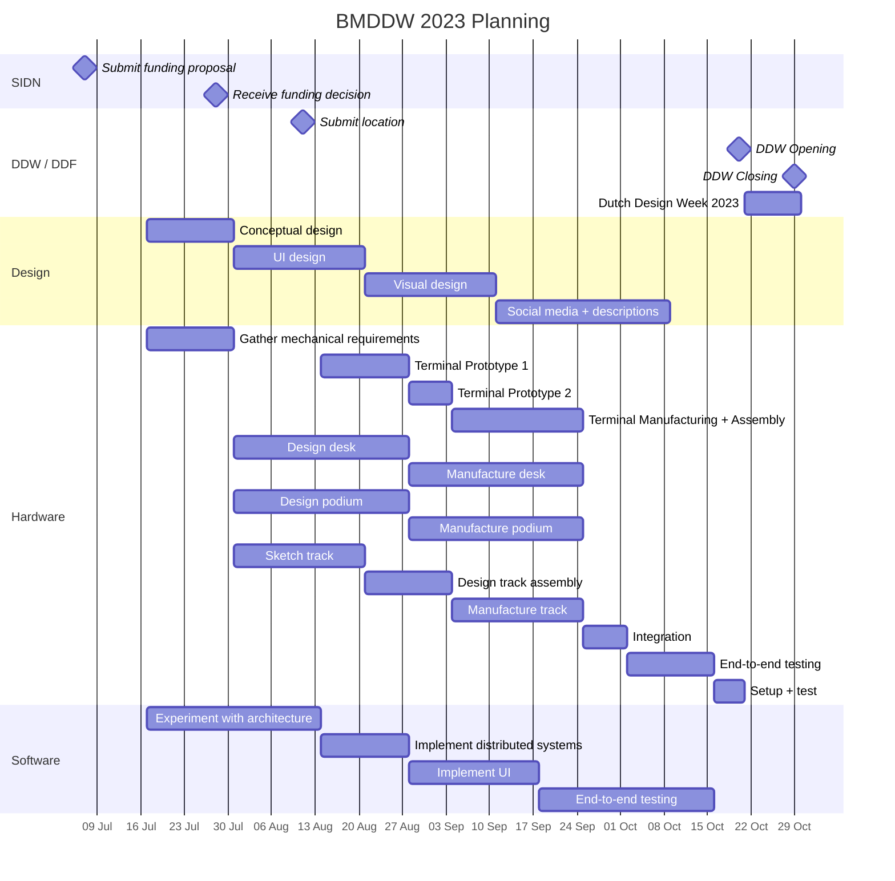

```mermaid
gantt
    title BMDDW 2023 Planning
    tickInterval 1week
    dateFormat DD-MM-YYYY
    axisFormat %d %b
    % weekday monday

    section SIDN
        Submit funding proposal: milestone, proposal, 07-07-2023, 0
        Receive funding decision: milestone, after proposal, 6w

    section DDW / DDF
        Submit location: milestone, 11-08-2023, 0
        DDW Opening: milestone, 20-10-2023, 0
        DDW Closing: milestone, 29-10-2023, 0
        Dutch Design Week 2023: 21-10-2023, 9d

    section Design
        Conceptual design: conceptual_design, 17-07-2023, 2w
        UI design: ui_design, after conceptual_design, 3w
        Visual design: visual_design, after ui_design, 3w
        Social media + descriptions: social_design, after visual_design, 4w

    section Hardware
        Gather mechanical requirements: mech_requirements, 17-07-2023, 2w

        % Terminals
        Terminal Prototype 1: terminal_prototype_1, 14-08-2023, 2w
        Terminal Prototype 2: terminal_prototype_2, after terminal_prototype_1, 1w
        Terminal Manufacturing + Assembly: terminal_final, after terminal_prototype_2, 3w

        % Other assemblies
        Design desk: design_desk, 31-07-2023, 4w
        Manufacture desk: manufacture_desk, after design_desk, 4w
        Design podium: design_podium, 31-07-2023, 4w
        Manufacture podium: manufacture_podium, after design_podium, 4w
        Sketch track: sketch_track, 31-07-2023, 3w
        Design track assembly: design_track_assembly, after sketch_track, 2w
        Manufacture track: manufacture_track, after design_track_assembly, 3w

        Integration: integrate_assemblies, 25-09-2023, 1w
        End-to-end testing: 02-10-2023, 16-10-2023
        Setup + test: 16-10-2023, 21-10-2023

    section Software
        Experiment with architecture: software_architecture, 17-07-2023, 4w
        Implement distributed systems: software_distributed_systems, after software_architecture, 2w
        Implement UI: software_ui, after software_distributed_systems, 3w
        End-to-end testing: after software_ui, 4w
```
